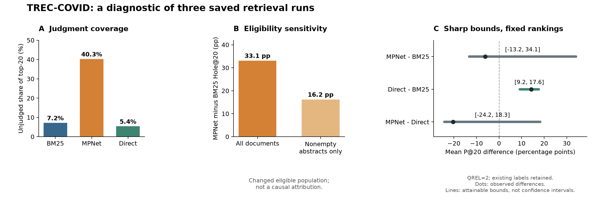

# TREC-COVID 文档选择方法的部分复现与判断覆盖诊断

**修订短报告 · 2026-09-05 · 当前研究结论的默认阅读入口**

本项目整理了 BM25、单一 MPNet 检索器和二者的 Direct 融合在 BEIR 版 TREC-COVID 全部 50 个查询上的固定排名、原始判断文件与复算程序。可复核的结果是：当前方法的判断覆盖率存在较大差异；排除无摘要文档后，BM25 与 MPNet 的差距缩小；固定排名及既有标签时，补齐未判断标签不足以翻转 Direct 相对 BM25 的平均 P@20 优势。以上结果不证明 MPNet 被低估，也不验证源研究的下游发现。

**阅读路径：**本报告 → [勘误表](ERRATA.md) → [方法与计算定义](METHODS.md) → [仓库运行说明](../README.md)。历史报告按[归档说明](../archive/README.md)原样保留在本地，解释与本报告冲突时，以本报告及勘误为准。

## 1. 研究问题与定位

Rangreji、Zhong 与 Field 的研究讨论文档选择如何影响面向查询的文本分析。本项目只重建其 TREC-COVID 检索验证的部分方法，并检查这些方法取出的文档是否在所用 qrels 中拥有有效判断。它没有复现完整的主题建模、主题发现或下游效用实验，也没有获得源作者的逐查询运行以认证精确复现。[源研究，arXiv:2604.12099v1](https://arxiv.org/abs/2604.12099v1)

本项目定位为复现与诊断作品。BEIR 已在同一数据集的 §6、Table 4 分析 Hole@10，盲评 980 个查询—文档对，并报告补评后 ANCE 与 BM25 的评价次序改变；其 §5、Figure 4 也比较过 dense 模型的文档长度偏好。因此，Hole 指标、判断覆盖不均以及补评可能改变排序均不作为本项目的新贡献。[BEIR 原文](https://arxiv.org/pdf/2104.08663)

## 2. 数据与范围

使用 BEIR 版本的 171,332 篇文档、50 个查询和 66,336 行 qrels。其中 66,334 对具有 0、1、2 中的有效标签；其余两行标签为 −1，按未判断处理。本文的 U 指“在这一版本中无有效判断”，不指文章历史上从未接受评判。qrel=0 与 U 在数据和覆盖统计中始终不同。

每个方法每题保留 top-1000；本文突出 @20 和 @100，其余深度作为补充描述。MPNet 指 `sentence-transformers/all-mpnet-base-v2`，历史文件中的 `SBERT` 在当前产出中统一记作 `mpnet`。Direct 使用两个组件各 top-1000 的并集，将各分数除以该组件最大值后相加。源文的融合措辞与公式、候选池深度等存在不确定性，详见[方法说明](METHODS.md)。

## 3. 可保留的结果

### 3.1 当前排名的判断覆盖差异

Hole@k 是 top-k 中 U 的比例；表中是 50 个查询等权平均。它度量判断可用性，不直接度量检索质量。

| 深度 | BM25 | MPNet | Direct |
|---|---:|---:|---:|
| @20 | 0.0720 | 0.4030 | 0.0540 |
| @50 | 0.1336 | 0.4440 | 0.0836 |
| @100 | 0.1960 | 0.4918 | 0.1464 |
| @1000 | 0.62780 | 0.73550 | 0.59564 |

MPNet−BM25 的平均 Hole 差在 @20 为 **33.10 个百分点**，@100 为 **29.58 个百分点**。逐查询比较分别为 39 正、8 平、3 负和 46 正、0 平、4 负。方向在多数查询中一致，但并非没有反例，也不能推广到所有 dense 模型或其他数据集。

表格与逐查询差值可由[覆盖汇总](../results/coverage_summary.csv)、[逐查询覆盖](../results/coverage_by_query.csv)和[配对差值汇总](../results/paired_coverage_summary.csv)核查。50 题是该固定基准的完整查询集，这里报告有限总体描述量；本报告不使用显著性检验替代对新任务代表性的证据。

### 3.2 无摘要文档值得单独检查

在各方法自己的 top-20 中，BM25 的无摘要比例为 **3.8%**，MPNet 为 **64.2%**。这些是不同检索集合内的描述比例，不能当作匹配后的因果比较。[摘要分层结果](../results/abstract_strata.csv)

进一步在全库的 129,192 篇非空摘要文档中，沿用原评分定义与既有向量，重新取每题 top-k。BM25/MPNet 的 Hole@20 为 **0.064/0.226**，@100 为 **0.1916/0.3694**，对应差距为 **16.20/17.78 个百分点**。这里保留全库 BM25 的 IDF 和平均文档长度；没有仅从已有 top-k 中删去空摘要后缩小分母。[非空摘要敏感性汇总](../results/nonempty_coverage_summary.csv)

该检查改变了可入选文档总体，说明结果对文档可用性限制敏感；它不估计摘要缺失的因果效应，也不能解释为“摘要缺失造成了差异的某个百分比”。这项分析最初来自审计，本次发布保留其排名与可复算定义。

### 3.3 不补评也能确定的 P@20 差值范围

按源验证的 QREL=2 定义，0、1 不计为相关，U 暂不计相关，三方法观察 P@20 为 BM25 **0.487**、MPNet **0.426**、Direct **0.630**。这里的处理是观察指标的计算约定，不是把 U 认定为人类判定的不相关。

固定当前 top-20 排名，假定已有有效标签正确，允许每个 U 任意取相关或不相关，但同一查询—文档对在各方法间共享标签，可得到以下严格可达界限。共同 U 对配对差的影响抵消。

| 平均 P@20 差 | 观察值 | 可达下界 | 可达上界 |
|---|---:|---:|---:|
| MPNet−BM25 | −0.061 | −0.132 | 0.341 |
| Direct−BM25 | 0.143 | 0.092 | 0.176 |
| MPNet−Direct | −0.204 | −0.242 | 0.183 |

因此，在上述条件下，填补当前 U 无法翻转 Direct 对 BM25 的优势；MPNet 的相对排序仍未确定。这不是置信区间，也不适用于更换排名、纠正已有标签或改变相关性定义后的评价。[观察 P@20](../results/observed_precision_summary.csv) · [配对界限](../results/paired_precision_bounds_summary.csv) · [公式](METHODS.md)

三个 top-20 列表并集共有 2,170 个查询—文档对，其中 **492 对未判断**，涉及 461 篇不同文档。本仓库提供[未判断清单](../results/top20_unjudged_frame.csv)，用于界定尚缺的证据；没有进行人工补评，也没有提供新的相关性标签。

## 4. 解释修订与研究边界

覆盖差异不直接等于评分误差。若 U 全不相关，Hole 可以相差很大而观察 P@20 没有漏计相关项；若 U 中存在相关项，误差还取决于各方法未判断数量和其中相关比例。当前数据没有识别这部分相关性。

历史 pooling 为判断缺失提供了背景，但本项目未重建实际选入判断池的运行、轮次及 BEIR/NIST 的 ID 整理链，因而不能认定词面方法主导历史池并造成当前差距。NIST 官方资料还说明了多轮语料、查询与判断的变化，不能将最终 qrels 简化为一次统一深度的 BM25 pool。[NIST 数据说明](https://ir.nist.gov/covidSubmit/data.html)

本报告撤回“已证明 pooling bias”“MPNet 被系统性低估”“构念效度已被否定”“源研究下游发现被扭曲”等尚无证据支持的结论。Direct 的较好覆盖也不等于它主要取两个组件的严格交集。具体历史表述与更正见[三列表勘误](ERRATA.md)。

## 5. 可复核程度与结项状态

核心产出由保存的排名、原始 qrels、查询及文档元数据重算。新的复算程序不导入原项目聚合函数；这支持检查固定输入到表格的计算链，不能自行验证原始判断的正确性。摘要敏感性及 P@20 界限的发现来源是现存审计，本次工作将它们整理为可运行产出；非空摘要排名的 400 个覆盖单元已用原始 qrels 重新计算并与审计结果逐项一致。该过程不称为新增人工专家评审。

核心发布限于 BM25、MPNet 和 Direct。后续其他检索器扩展已在原项目中留存，不纳入本短报告结论。原冻结材料保留历史状态；既有“事前冻结”说明不作为经过独立时间戳证明的预注册。此次也没有重新编码全部文档来完成全链冷启动复现。

按 ACM 研究材料的文档、完整性、一致性及可运行性要求整理，是本仓库的组织目标；本项目没有获得 ACM artifact badge 或外部评审认证。[ACM Artifact Review and Badging](https://www.acm.org/publications/policies/artifact-review-and-badging-current)

当前成果作为范围有限的科研起步作品结项：保存可核查的复现、敏感性与数学界限，记录解释如何随证据修订。是否重启，取决于能否提出超出已有同库研究的明确问题，以及一个能改变研究决策的低成本检验。补全所有未知、增加更多模型或进行下游实验，均不是本次固化的完成条件。
