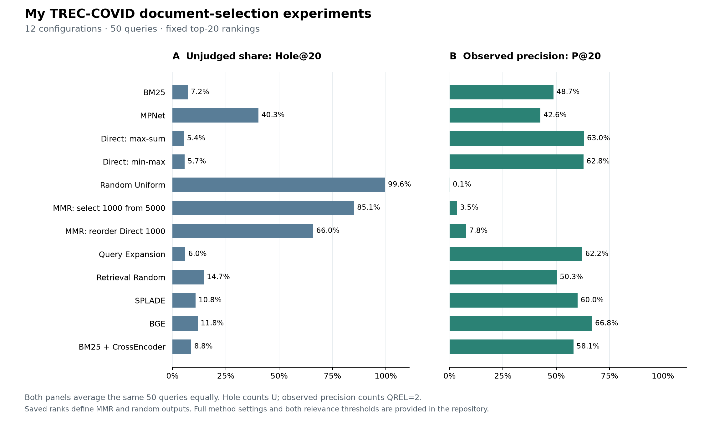

# TREC-COVID 文档选择实验：方法复现与评估分析

**我的研究短报告 · QronG9 · v2.0.0 · 2026-09-05**

我以一项文档选择研究为起点，在 BEIR 版 TREC-COVID 上重建检索与选择方法，并考察固定排名中的判断覆盖、观察相关性、文档组成和候选集合。我的分析从五个查询开始，扩展至全部 50 个查询，随后完成更多模型和选择配置。本版汇集 12 个全查询配置、初始五查询结果、非空摘要补充实验和配对 precision 界限，并提供可以离线重算的输入与程序。

**阅读路径：**本报告 → [方法与计算定义](METHODS.md) → [研究过程](RESEARCH_PROCESS.md) → [仓库运行说明](../README.md)。本报告是当前版本的默认阅读入口。

## 1. 我研究的问题与实验路径

Rangreji、Zhong、Field 的研究讨论文档选择如何影响面向查询的文本分析。我选择其中的 TREC-COVID 检索验证环节作为复现起点，把实验落在三个具体问题上：不同选择方法得到哪些文档；现有 qrels 对这些文档覆盖多少；在固定结果和现有标签下，可以计算哪些检索指标与比较界限。[源研究](https://arxiv.org/abs/2604.12099v1)

我使用 BEIR 的数据组织与评估背景。BEIR 对 Hole 和补充相关性判断的讨论，为我区分“判断覆盖”与“观察质量”提供了依据；我在这一背景上完成具体方法实现、全查询比较、输入条件与候选集合分析。[BEIR](https://arxiv.org/abs/2104.08663)

我的工作经历了四个相互衔接的阶段：

| 阶段 | 我完成的内容 | 本版保存的结果 |
|---|---|---|
| 初始五查询分析 | 查询 9、13、34、45、48；四个基本方法、Direct min-max 与三个补充选择方法 | 八配置 × 五查询 × 1000 条排名，共 40,000 条 |
| 全查询基线 | BM25、MPNet、Direct、Random Uniform，以及 Direct min-max | 五配置的全部 50 查询排名与评价 |
| 冻结后扩展 | 全查询 MMR、Query Expansion、Retrieval Random；加入 MMR 重排变体、SPLADE、BGE、BM25 + CrossEncoder | 全查询配置合计 12 个，共 600,000 条主排名 |
| 评估分析与发布 | 摘要分层、非空摘要排名、未知标签界限、通用文件导出和复算流程 | 两个非空摘要配置另有 100,000 条排名；完整结果与验证材料 |

五个基础配置在初始阶段已生成全 50 查询排名；五查询材料取其中对应查询。MMR、Query Expansion、Retrieval Random 则先保存五查询运行，再完成全查询扩展。

各组排名文件可以分别读取；合计 **740,000 条保存的排名位置**。我以原始冻结记录保留阶段成果，再将已完成的补充运行纳入本版。这里的“冻结”指文件版本与哈希记录，具体来源见[研究过程](RESEARCH_PROCESS.md)和[版本记录](../provenance/README.md)。

我还保留五查询与全查询运行的对应检查。MMR 和 Query Expansion 在这五题上的 top-1000 次序逐项相同；Retrieval Random 因查询遍历推进同一种子随机流，在两个阶段得到不同抽样，五题平均集合重合率为 0.1902。我分别保存阶段结果和计算协议，使读者能够查看实验扩展时哪些输入与输出保持一致，以及随机过程如何对应到实际文档。[跨阶段对应表](../results/extensions/pilot_full50_overlap_summary.csv)

## 2. 我如何定义数据与比较

我使用 171,332 篇文档、50 个查询和 66,336 行 qrels。66,334 个查询—文档对的标签为 0、1、2；另两行 −1 与缺少有效标签的情况在计算中记为 U。我保留原始 qrels，让 **已判断的 0 与未判断的 U** 在数据和覆盖统计中始终可区分。U 的含义限于这一数据版本中的有效判断可用性。

我使用查询的自然语言 `text` 字段，文档由标题与摘要拼接，按具体模型记录的长度、前缀和评分设置生成排名。每个全查询配置每题保留 1000 篇不同文档。表中 MPNet 对应 `sentence-transformers/all-mpnet-base-v2`；Direct 默认指 BM25 与 MPNet 的 max-sum 融合。归一化变体、候选深度、随机流和并列处理均在[方法说明](METHODS.md)明确列出。

我在四个深度 @20、@50、@100、@1000 计算 Hole，即前 k 篇中 U 的比例。观察 precision 按现有标签计数：正文采用 `qrel=2`，U 暂不贡献相关命中；补充表另提供 `qrel≥1`。所有主表对这 50 个查询等权平均，描述的是这一固定基准的完整查询集。

## 3. 全查询比较带来了哪些结果

### 3.1 十二个配置的覆盖与观察指标

| 配置 | Hole@20 | Hole@100 | 观察 P@20 | 观察 Recall@1000 |
|---|---:|---:|---:|---:|
| BM25 | 0.0720 | 0.1960 | 0.487 | 0.509803 |
| MPNet | 0.4030 | 0.4918 | 0.426 | 0.497134 |
| Direct：max-sum | 0.0540 | 0.1464 | 0.630 | 0.611844 |
| Direct：min-max | 0.0570 | 0.1508 | 0.628 | 0.612986 |
| Random Uniform | 0.9960 | 0.9934 | 0.001 | 0.006417 |
| Direct + MMR：从 5000 选 1000 | 0.8510 | 0.8760 | 0.035 | 0.162314 |
| Direct + MMR：重排既有 1000 | 0.6600 | 0.6630 | 0.078 | 0.611844 |
| Query Expansion | 0.0600 | 0.1570 | 0.622 | 0.568064 |
| Retrieval Random | 0.1470 | 0.4228 | 0.503 | 0.173305 |
| SPLADE | 0.1080 | 0.2636 | 0.600 | 0.512628 |
| BGE | 0.1180 | 0.2788 | 0.668 | 0.566764 |
| BM25 + CrossEncoder | 0.0880 | 0.2416 | 0.581 | 0.509803 |

来源：[覆盖汇总](../results/extensions/coverage_summary.csv)、[观察指标汇总](../results/extensions/observed_ir_summary.csv)。以上 precision/recall 使用严格相关性阈值；更高精度数值和逐查询结果保存在 CSV 中。

我把覆盖与观察指标并列，是因为它们提供不同信息。例如，BM25 的 Hole@20 为 0.072，BGE 为 0.118；对应观察 P@20 为 0.487 和 0.668。读者可以同时看到判断可用性与现有标签确认的相关命中，而无需用一个指标代替另一个。

扩展后的结果也让我能够按具体模型报告稠密检索的表现：MPNet 与 BGE 的 Hole@20 分别为 0.403 和 0.118。两者使用不同模型、训练来源及输入设置；这组比较描述这些已记录配置的结果。SPLADE 与 BM25 + CrossEncoder 则提供了另外两种神经检索 / 重排配置，便于在同一数据与标签下逐项比较。

### 3.2 我分别检查文档集合与前列顺序

我设计了两个直接可检验的集合保持条件。BM25 + CrossEncoder 对 BM25 top-1000 全部重评分，最终集合逐题相同。因此，二者 Hole@1000 均为 0.6278，Recall@1000 均为约 0.509803；前 20 项的观察 P@20 从 0.487 变为 0.581。

同样，MMR 重排变体保留 Direct top-1000 集合，二者 Hole@1000 均为 0.59564、Recall@1000 均为约 0.611844。MMR 的逐步选择顺序改变前列组成，Hole@20 为 0.660。另一 MMR 配置从 Direct top-5000 选取 1000，其最终集合允许变化，对应 Hole@1000 为 0.86392。通过保存这两种配置，我把候选集合选择和集合内顺序变化落实为可以逐查询核查的对象。[集合一致性检查](../results/extensions/set_invariance_checks.csv)

我另计算各配置与 BM25 同深度结果的重合率、共享与独有文档的判断覆盖，以及返回文档位于 BM25 top-1000 内外的组成。最后一项的候选边界明确是已保存的 BM25 top-1000，读者可以直接检查给定候选深度包含了哪些文档。[集合重合](../results/extensions/overlap_vs_bm25_summary.csv) · [集合分层](../results/extensions/judged_shared_exclusive_summary.csv) · [候选成员关系](../results/extensions/bm25_candidate_membership_summary.csv)

Query Expansion 还保存了每题实际使用的关键词；Retrieval Random 则在 Direct top-5000 中均匀无放回抽取 1000 篇，并保留所抽文档的 Direct 相对顺序。这些记录使方法名称能够对应到具体的输入、选择和排序过程。

### 3.3 归一化与摘要可用性补充

我分别运行 Direct 的 max-sum 和 min-max 归一化，观察 P@20 为 0.630、0.628，Hole@20 为 0.054、0.057。两份固定排名使读者可以进一步检查分数归一化变化对应的名次与集合变化。

我还从文档输入检查 BM25 和 MPNet 的结果组成。在各自 top-20 中，无摘要文档比例分别为 3.8% 和 64.2%。这些比例按各方法实际返回的文档计算，分层表同时给出文档数、有效判断数和相关命中。[摘要分层](../results/abstract_strata.csv)

随后，我在全库的 129,192 篇非空摘要文档中，沿用既有评分定义重新取前列。BM25 保留原全库 IDF 和平均文档长度；MPNet 复用既有文档向量。每题仍取得完整 top-k。两者 Hole@20 为 0.064、0.226，差为 16.2 个百分点；原全库差为 33.1 个百分点。在 @100，非空摘要条件下的差为 17.78 个百分点。[非空摘要结果](../results/nonempty_coverage_summary.csv)

我将这项结果报告为文档可入选条件的敏感性比较。它同时保留原全库结果和筛选后的排名，展示改变可入选文档总体时，相同评分定义如何对应不同的覆盖结果。

## 4. 我如何量化未知标签对方法比较的影响

对两个固定 top-k 列表，我让同一查询—文档对的 U 在方法间共享一个二值相关标签，并保留所有既有标签。共享 U 在两方法 precision 差中抵消；只有各方法独有的 U 可以改变配对差。由此，我计算每个查询及查询平均的严格可达下界和上界。

三个基线在 P@20、QREL=2 下的结果为：

| 平均 P@20 差 | 观察值 | 可达下界 | 可达上界 |
|---|---:|---:|---:|
| MPNet−BM25 | −0.061 | −0.132 | 0.341 |
| Direct−BM25 | 0.143 | 0.092 | 0.176 |
| MPNet−Direct | −0.204 | −0.242 | 0.183 |

Direct−BM25 的整个区间为正：在固定排名、保留已有标签和当前相关性阈值下，对 U 的任意二值补全均保留 Direct 的平均优势。另两个区间跨越零，明确给出各自可达的比较范围。这些是未知标签赋值的数学界限，区间端点可通过具体赋值达到。公式和适用条件见[方法说明](METHODS.md)。

我将这一计算扩展至其余配置相对 BM25 的比较，发布 @20、@100 和两个相关性阈值的逐查询界限。在同样的 P@20 与 QREL=2 条件下，BGE−BM25 的范围为 **[0.113, 0.295]**，SPLADE−BM25 为 **[0.045, 0.217]**，BM25 + CrossEncoder−BM25 为 **[0.028, 0.176]**，Query Expansion−BM25 为 **[0.084, 0.174]**。这些区间均为正，明确量化了保存排名中哪些平均比较在全部允许的 U 补全下保持方向。同时，三个基线的 top-20 并集共 2,170 个查询—文档对，其中 492 个为 U，涉及 461 篇不同文档；我导出这些对及其方法名次，作为可以继续查看的标签可用性清单。[三基线界限](../results/paired_precision_bounds_summary.csv) · [扩展界限](../results/extensions/paired_precision_bounds_summary.csv) · [492 对清单](../results/top20_unjudged_frame.csv)

## 5. 我提供的可复算成果

我的贡献汇集为一条从具体方法、保存排名、原始判断到结果表的可检查路径：全查询方法比较、候选集合与顺序对照、文档可用性敏感性、未知标签界限，以及分阶段版本记录。

我把发布入口设在固定排名到结果的离线复算层：仅用 Python 标准库即可重建表格。原始语料到排名的生成配置、代码来源、模型标识和运行记录另行保留；排名与输入文件以哈希固定。本版验证记录分别说明文件完整性、计算结果一致性和程序测试。[复算说明](../README.md) · [本版验证](../provenance/RELEASE_VALIDATION.md)

我参考 ACM 对研究材料说明充分、前后一致、范围内完整和能够执行的要求组织仓库。文献、数据、第三方模型与代码分别保留来源；我使用 AI 辅助实现、核验和写作，并对研究范围与公开材料负责。[ACM 材料标准](https://www.acm.org/publications/policies/artifact-review-and-badging-current) · [我的贡献与工具使用](CONTRIBUTIONS.md)
